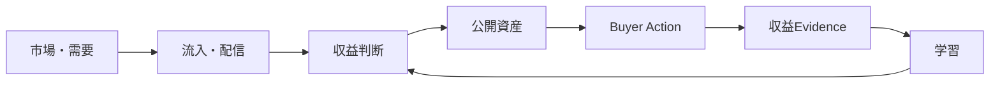

# Vector Praxis Works Hub

> **見る場所に迷わないための入口**  
> Vectorの公開資産・収益循環・能力研究・自動化を、役割ごとに追えるように整理しています。

| 🌐 公開価値 | 💰 収益循環 | 🧠 能力研究 | ⚙️ 自動化 | 🗺 全体構造 |
|---|---|---|---|---|
| [`app/`](app/) | [`distribution/`](distribution/) | [`capability-lab/`](capability-lab/) | [`.github/workflows/`](.github/workflows/) | [`STRUCTURE_MAP`](docs/STRUCTURE_MAP.md) |
| サイト・診断・Utility | 流入・反応・収益証拠 | 能力獲得・検証 | 定期実行・同期 | Repoを俯瞰する |



**詳細マップ：[`docs/STRUCTURE_MAP.md`](docs/STRUCTURE_MAP.md)**

---

Vector Praxis Works Hub is the general public asset base inside the broader Digital Index Base structure.

It organizes practical AI use, building, monetization, creator work, publishing, reusable utilities, and return routes without turning Vector into the owner of Stratum's B2B offers.

Public-facing structure:

- Start
- Build
- Earn
- Creator
- Read
- Return

The public design and copy are original to Vector Praxis. Do not copy third-party product UI, logos, branded layouts, questionnaires, result text, or proprietary visual systems. External services may be linked only as destinations where relevant; they are not used as visual templates for this site.

## Production

- Current public URL: https://vector-praxis-japan.user-ex26.chatgpt.site/
- Free AI Agent Bottleneck diagnostic: https://vector-praxis-japan.vercel.app/ai-agent-bottleneck?utm_source=github&utm_medium=repository&utm_campaign=vab15&utm_content=readme_diag_v1&asset_id=ai_agent_bottleneck&route_id=vpj_owned_ai_agent_bottleneck_v2
- note: https://note.com/deft_eel6718
- Deployment migration: [`docs/zero-cost-hosting-migration.md`](docs/zero-cost-hosting-migration.md)
- Verified asset inventory: [`docs/asset-inventory.md`](docs/asset-inventory.md)

The existing Sites URL remains live and canonical until a replacement production URL is publicly reachable without authentication.

## Current public role

Vector is an asset base and navigation hub, not the umbrella operating system by itself. Digital Index Base is the umbrella structure.

Vector may hold non-Stratum public assets, creator/practical-AI routes, publishing surfaces, diagnostics, utilities, and reusable experiments that have earned a public role.

B2B decision tools, audits, team/enterprise operating offers, and the independent `stratumpraxis.com` business surface belong to Stratum and should not be promoted as Vector-owned offers.

Research may prototype one-page utilities and inbound-revenue experiments before promotion. MARKET remains the separate outward market/revenue circulation layer. Do not collapse those operating roles into the Vector public navigation.

## GWR

Global Work Radar is maintained as a distinct public asset with its own production route and operating logic. Its current direction is inbound revenue: useful labor intelligence and repeat utility -> CTA / revenue-bearing action -> verified checkout/payment evidence. The current merged GWR redesign is the refinement base; do not replace it with a new concept or turn it back into manual outbound sales.

## Local verification

```bash
npm ci
npm run build:vercel
npm test
```

## Deployment

`vercel.json` configures the Vercel production build with Next.js. Canonical, Open Graph, robots, and sitemap origins are centralized in `lib/site-url.ts` and accept an HTTPS `SITE_ORIGIN` override.

Do not change the canonical origin until the replacement URL returns HTTP 200 to an unauthenticated request.
