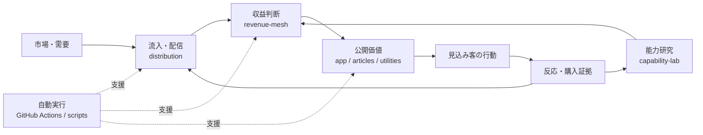
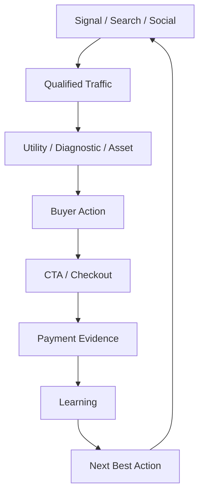
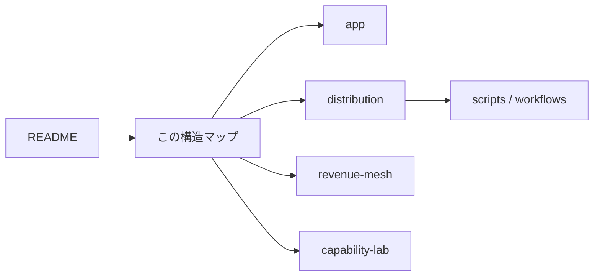

# Vector Praxis｜構造マップ

> このページは、Repo全体を「何のための層か」で読むための案内図です。ファイル名ではなく、役割から現在地を掴むことを目的にしています。

## 全体像



**Repoの中心思想**

市場を見る → 既存資産へ接続する → 流入を作る → 反応を測る → 収益証拠を残す → 学習して次の行動精度を上げる。

---

## 5つの主要レイヤー

| レイヤー | 主な場所 | 役割 |
|---|---|---|
| 🌐 公開価値 | `app/` `ai-stack-optimizer/` `articles/` `public/` | ユーザーが直接触るサイト・診断・記事・公開資産 |
| 💰 収益循環 | `distribution/` `revenue-mesh/` | 流入、見込み客反応、収益証拠、次の収益行動 |
| 🧠 能力研究 | `capability-lab/` `docs/` | 能力獲得、研究、実行履歴、設計思想の蓄積 |
| ⚙️ 自動実行 | `.github/workflows/` `scripts/` `worker/` | 定期実行、公開、観測、同期、収益ループの自動処理 |
| 🧱 基盤 | `components/` `lib/` `config/` `db/` `drizzle/` `tests/` | UI部品、設定、データ、共通処理、品質保証 |

---

## 収益循環だけを見る



### 収益関連の主要場所

- `distribution/` — 配信・反応・収益証拠の状態保存
- `revenue-mesh/` — 外部Signalと既存資産を収益候補へ接続
- `scripts/revenue-*` — 収益判断・証拠・安全判定の実行処理
- `.github/workflows/revenue-*` — 定期・自動実行
- `config/vector-revenue-event-contract.json` — 収益イベントの共通契約
- `docs/revenue-execution/` — 実行サイクルの記録
- `docs/revenue-pump/` — 収益導線の設計資料

---

## 公開資産だけを見る

```text
app/
├─ page.tsx                  # Vector本体
├─ ai-agent-bottleneck/      # 診断入口
├─ library/                  # 資産ライブラリ
├─ vector-works/             # Works導線
├─ vector-revenue-layer.*    # 収益接続レイヤー
└─ vector-premium-layer.*    # 見せ方・価値提示レイヤー

ai-stack-optimizer/           # 独立Utility
articles/                     # 公開記事・Evidence
public/                       # ロゴ・画像・動画など
```

---

## 能力研究だけを見る


主な場所：

- `capability-lab/README.md` — 能力研究の入口
- `capability-lab/external-capability-registry.json` — 外部能力候補
- `capability-lab/evidence/` — 検証証拠
- `capability-lab/scripts/` — 能力供給・検証処理
- `capability-lab/revenue-agent-benchmark.json` — 収益能力評価

---

## 自動化だけを見る

`.github/workflows/` は「自動で動く神経」、`scripts/` は「実際の筋肉」と考えると分かりやすいです。

代表系統：

| 系統 | 目的 |
|---|---|
| `revenue-*` | 収益Evidence、候補選定、反応観測 |
| `gwr-*` | GWR更新・成長循環 |
| `social-*` | SNS配信 |
| `capability-*` | 能力獲得・研究 |
| `vector-public-*` | 公開導線の検証 |

---

## 初めて見るときの順番



1. `README.md` でVectorの役割を見る
2. `docs/STRUCTURE_MAP.md` で全体構造を見る
3. 公開物なら `app/`
4. 収益なら `distribution/` → `revenue-mesh/`
5. 研究なら `capability-lab/`
6. 自動処理なら `.github/workflows/` → `scripts/`

---

## 境界

Vectorは公開資産・実用AI・Creator・診断・Utility・収益実験を保持する場所です。

StratumのB2B商品・監査・企業向け意思決定資産は、Vector所有として混ぜません。MARKETは外部市場と収益循環を担当する別レイヤーとして扱います。

この構造マップは**既存機能を移動・破壊せず、Repoの意味を可視化するための案内層**です。
